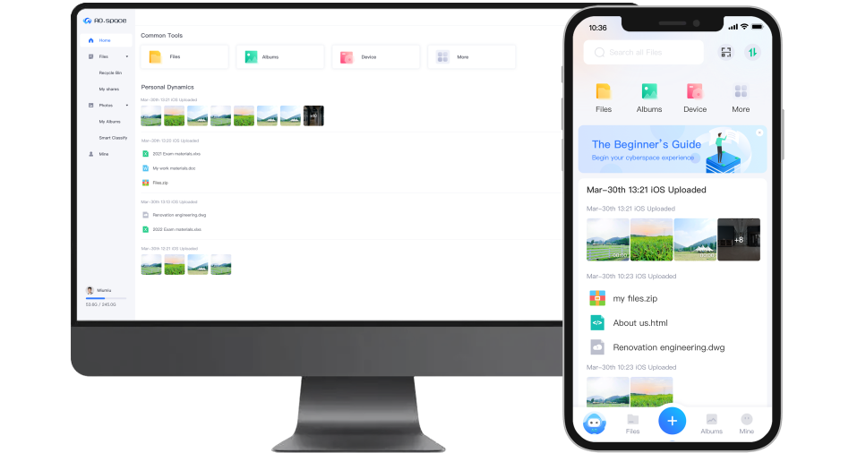

# AO.space

This article will introduce you to the concept, overall design, functions and how to install and deploy AO.space.

Through this article you can learn the following:

- [What is AO.space](#what-is-ao.space)
- [Architecture Design](#architecture-design)
- [Build and deploy](#build-and-deploy)
- [Contact us](#contact-us)

## What is AO.space

AO.space is a solution that focuses on protecting personal data security and privacy. Utilizing end-to-end encryption and device-based authentication, users have complete control over their personal accounts and data. AO.space also employs various technologies, including transparent platform forwarding, peer-to-peer acceleration, and LAN direct connection, to enable fast access to personal data from anywhere at any time. Leveraging Progressive Web App and cloud-native technology, AO.space has developed an integrated application ecosystem that could include both front-end and back-end components.

AO.space is composed of three parts: server-side, client-side, and platform-side. The server-side and client-side run on personal devices and establish encrypted communication channels with public key authentication. The server-side supports x86_64 and aarch64 architectures and can run on personal servers, computers, or other similar devices. The client-side supports Android, iOS, and Web platforms, providing users with the convenience of using AO.space anywhere and anytime. For platform side, user can either use the default platform provided by AO.space or deploy by own. In both cases, the platform provides network communication services without the capability to decipher user data.

### Main features

- Multi-platform support: Provides a multi-platform solution and supports running on Windows, Linux, macOS (Intel/M1) systems.
- Distributed Digital Identity (DID): A globally unique digital identity developed based on W3C DIDs recommended standards that is decentralized, does not rely on blockchain, and is safe and reliable.
- End-to-end encrypted communication method: The first binding achieves end-to-end authentication by exchanging public keys, and the application session communicates encrypted through end-to-end peer-to-peer keys.
- LAN communication direct connection: Encrypted direct connection is realized in the LAN, without the need to transfer through the Internet server, saving traffic and improving transmission efficiency.
- P2P access channel: supports peer-to-peer direct connection (P2P) technology to help improve security, performance and reliability.
- Application authorization and authentication process: Through the open API provided by Aokang, developers can develop Aokang applications on their own; users can expand Aokang's functions by downloading, installing and running Aokang applications. AO.space applications obtain end-to-end encrypted authentication and access permissions for open APIs through user authorization, and the basic principle is that "the platform cannot obtain user data".

### The main function

- File management: extremely fast transfer of all types of files; anytime access and quick preview from multiple terminals; rapid data organization and synchronization.

- Smart photo album: intelligent classification of time, place, festival and other types; today in history, important anniversaries regularly generate memories to reminisce about the good years.

- Application Center: integrated front-end and back-end architecture design, one-click installation, shared use by multiple members; supports docker, massive applications, and free deployment.

- Family sharing: local account, free from platform constraints; independent use of space, data isolation from each other; independent control of access rights and frequency.

- Device management: full-disk encrypted storage to prevent data tampering; dual-disk backup to protect data from loss; incremental backup for easy recovery, efficient and safe.

## Architecture design

### Architecture

The AO.space system is composed of three main components: the server, the platform, and the client. The server is built into the device (also known as AO.space box). The platform offers fundamental network resources and relevant management. The client includes Web, iOS, Android platforms. Below is a general architectural design diagram for these components. We will go through each component and provide further details for them.

For detailed architecture design, please refer to the [Architecture](./architecture-design.md) document

## Build and deploy

Please check [AO.space build and deploy](https://github.com/ao-space/ao.space/blob/dev/docs/en/build-and-deploy.md)

## Contact us

- Email: <developer@ao.space>
- Website：[https://ao.space](https://ao.space)
- Slack discussion group：[https://slack.ao.space](https://slack.ao.space)

If you encounter difficulties in using it, you can check AO.space [Help](https://ao.space/en/support/help) or file an issue on [GitHub](https://github.com/ao-space/ao.space) for help.

# AO.space 傲空间

本文将为你介绍 AO.space 傲空间（以下简称傲空间）的概念、整体设计、功能以及如何安装部署傲空间。

通过本文你可以了解到以下内容：

- [傲空间是什么](#傲空间是什么)
- [架构设计](#架构设计)
- [如何安装傲空间](#安装傲空间)
- [联系我们](#联系我们)

## 傲空间是什么

**AO.space 傲空间**（以下简称傲空间）是一个以保护个人数据安全和隐私为核心的解决方案。通过端对端加密、基于设备认证等技术，确保用户完全掌控个人账号和数据。同时，采用平台透明转发、点对点加速、局域网直连等技术，让用户随时随地的极速访问个人数据。傲空间利用 PWA（Progressive Web App）和云原生技术，设计并打造前后端一体的应用生态。

**AO.space 傲空间**由服务端、客户端、平台端三个部分组成。服务端和客户端只运行在个人设备上，使用公钥认证建立加密通信通道。服务端是傲空间管理保护用户数据的核心部分，目前支持 x86_64 和 aarch64 两个架构，可运行在个人服务器、个人计算机等设备上。客户端让用户在不同平台上快速安全的访问个人数据，目前支持 Android，iOS 和 Web，方便用户随时随地使用。平台端既可使用 AO.space 默认提供的平台，也可以自己部署，两种方式下平台都在无法解析用户数据的前提下提供网络通信服务。

### 主要特性

- 多平台支持： 提供了多平台解决方案，支持 Windows、Linux、macOS(Intel/M1) 系统上运行。
- 分布式数字身份（DID）：基于 W3C DIDs 推荐标准研发的、去中心化的、不依赖于区块链且安全可靠的全球唯一数字身份标识。
- 端到端加密的通信方式：首次绑定通过交换公钥实现端到端的认证，应用会话通过端到端对等密钥进行加密通信。
- 局域网通信直连：局域网内实现加密直连，无需通过互联网服务器中转，节省流量，提升传输效率。
- P2P访问通道：支持点对点直连（P2P）技术，帮助提高安全性、性能和可靠性。
- 应用授权和认证过程：通过傲空间提供的开放 API，开发者可以自行开发傲空间应用；用户通过下载、安装和运行傲空间应 用，实现傲空间功能的扩展。傲空间应用通过用户授权获得开放 API 的端到端加密认证和访问权限， 并以“平台无法获得用户数据”为基本原则。

### 主要功能

- 文件管理：各类文件极速传输；多端随时访问、快速预览；数据快速整理与同步。

- 智能相册：时间、地点、节日等类型智能分类；历史的今天，重要纪念日定时生成回忆，回味美好岁月。

- 应用中心：前后端一体架构设计，一键安装，多成员共享使用；支持 docker，海量应用，自由部署。

- 家庭共享：本地账号，摆脱平台束缚；空间独立使用，数据相互隔离；访问权限、频率自主可控。

- 设备管理：全磁盘加密存储，防止数据被篡改；双盘互备，保护数据不丢失；增量备份，轻松恢复，高效又安全。

## 架构设计

### 架构

傲空间系统由三个主要部分构成：服务端、客户端和平台端。服务端为个人空间的核心，部署于个人长期运行的并且联网的设备中，如个人服务器、个人计算机等。客户端为个人日常使用的电子设备，如手机、平板、个人电脑等，目前傲空间提供 Web、iOS 和 Android 等客户端。平台端在无法解析用户数据的前提下，为个人空间提供基础网络访问、安全防护等服务。以下是总体的架构设计草图和基础组件的详细信息。

详细架构设计请查阅文档 [架构](https://ao.space/docs/architecture-design)

## 安装傲空间

请查阅 [傲空间部署构建](https://github.com/ao-space/ao.space/blob/dev/docs/cn/build-and-deploy.md)

## 联系我们

- Email: <developer@ao.space>
- Website：[https://ao.space](https://ao.space)
- Slack discussion group：[https://slack.ao.space](https://slack.ao.space)

如果你在使用当中遇到困难，可查看傲空间 [帮助手册](https://ao.space/support/help) 或者在 [GitHub](https://github.com/ao-space/ao.space) 上提交一个 issue 寻求帮助。
